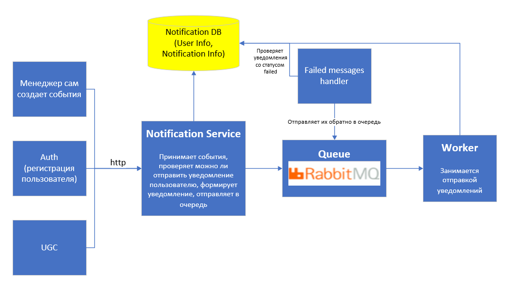
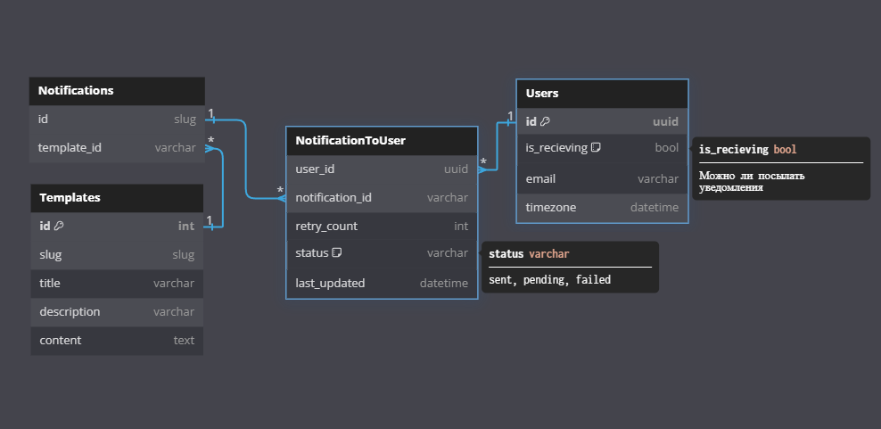

Проектная работа 10 спринта

Проектные работы в этом модуле в команде. Задания на спринт вы найдёте внутри тем.

## Ссылка на репозиторий - https://github.com/Andrei-Mihailov/notifications_sprint_1

## Используемый стек:

- `Django` - платформа для администрирования и отправки уведомлений пользователю/группе пользователей
- `Celery` - асинхронная распределенная очередь для запуска фоновой задачи отправки уведомлений
- `PostgreSQL` - база данных для хранения информации о шаблонах, уведомлениях, пользователях
- `FastAPI` - сервис для управления уведомлениями и отправки их через RabbitMQ
- `Clickhouse` - для хранения информации об отправленных уведомлениях

---

## Сборка и запуск

Для начала необходимо скопировать и заполнить файл .env из примера .env.example в папке `envs`.
Для сборки проекта выполните следующее из корневой папки:

- `make build`

Для запуска используйте:

- `make up`

## Для создания суперпользователя:

- `make superuser`

## Схема сервиса



---

## Схема БД



### Поля таблиц БД.

#### Template

- `slug` - id шаблона
- `title` - Заголовок
- `description` - Описание
- `content` - содержимое шаблона

#### Notification

- `template` - FK на шаблон
- `name` - Название шаблона, определяет очередь для отправки
- `type` - тип уведомления (единичное/групповое)
- `users` - пользователи, получающие уведомление
- `groups` - группа пользователей для уведомления

---

### Отправка уведомления из админки

Для отправки уведомления необходимо создать шаблон (Template) и затем создать уведомление (Notification), выбрав шаблон, тип уведомления, пользователей и/или группу(-ы) пользователей.
Далее, выберите нужное уведомление и в выпадающем меню выберите "Отправить уведомление пользователям"

---

## Отправка уведомления из других сервисов

Отправляем запрос, например с такими данными

```
{
    "receiver": "...",
    "event_name": "statistic",
    "type": "personal",
    "context": {"title": "new_films", "email": "...", films: [{"id": 1, "title": ..., "date":..., "description": ...}]}
}
```

```
curl --location --request GET '127.0.0.1:8080/api/v1/send-notification/email' \
--header 'Content-Type: application/json' \
--header 'Cookie: csrftoken=...' \
--data '{
    "receiver": "...",
    "event_name": "statistic",
    "type": "personal",
    "context": {"title": "new_films", "email": "...", films: [{"id": 1, "title": ..., "date":..., "description": ...}]}
}'
```

- `receiver` - UUID для персональной передачи или список UUID для всех пользователей (all)
- `event_name` - Название шаблона = Имя очереди
- `type` - Тип уведомления (personal/group/all)
- `context` - Контекст для использования в шаблоне
